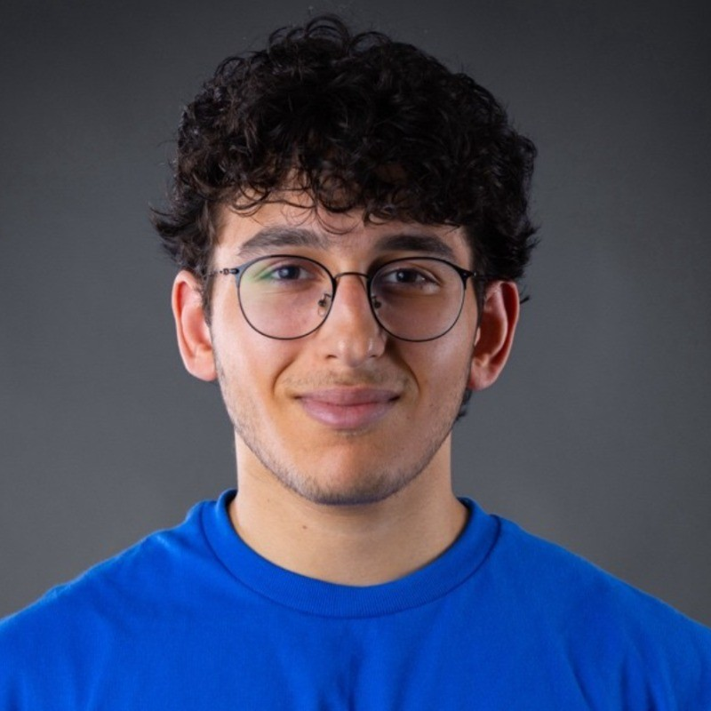
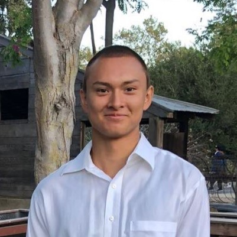

### __*SK Tutoring* is a student founded organization with an aim to help students succeed in STEM across the East Bay Area__
# Sami Halabieh

 I was born and raised in the Bay Area, and I am currently a second year student @ DVC studying Applied Mathematics. I am passionate about math and am always curious to learn new things. My free time is usually spent racing. 

### Relevant Coursework

1. Calculus 1-3
2. Linear Algebra
3. Differential Equations
4. Mechanics and Wave Motion
5. Thermodynamics and Electromagnetism
7. Advanced OOP (C++)
8. Data Structures and Algorithms

### Availability
- Monday, Wednesday 5-9PM
- Friday 3-8PM
- Saturday, Sunday All Day

#### Phone: +1 (925)-964-7401
#### Email: sami@sktutoring.org
#### Linkedin <https://www.linkedin.com/in/samihalabieh/>

# Kavin Glidden

 I am a first year student currently dual enrolled @ Diablo Valley College + UC Berkeley studying Computer Science and Electrical Engineering. I am also a tutor at Diablo Valley College. My free time is usually spent playing chess. 

### Relevant Coursework

1. Calculus 1-3
2. Linear Algebra
3. Differential Equations
4. Mechanics and Wave Motion
5. Thermodynamics and Electromagnetism
7. Advanced OOP (C++)
8. Data Structures and Algorithms

### Availability
- Friday All Day
- Saturday All Day
- Sunday 3-10PM

#### Phone: +1 (925)-922-0016
#### Email: kavin@sktutoring.org